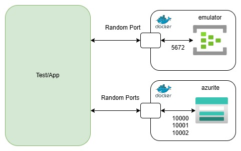
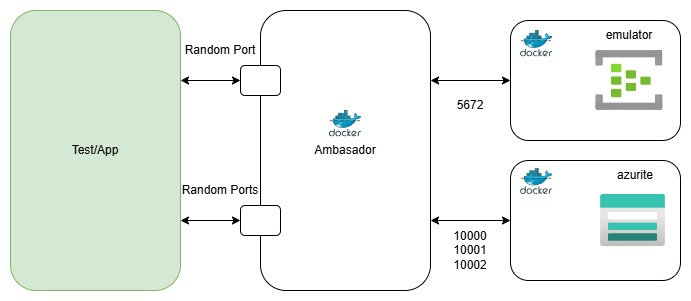

# Using EventHub Emulator as Test Container

This project demonstrates how to use the Event Hub Emulator as a test container.

Content:
1. Using Event Hubs Emulator - Legal
2. Building EventHub Emulator as Test Container

## Using Event Hubs Emulator - Legal

Event Hubs Emulator test container is based on the official [EventHubs Emulator](https://github.com/Azure/azure-event-hubs-emulator-installer) project.

`Azure Event Hubs Emulator` is licensed under [EULA (End User Licence Agreement)](emulator-legal/EMULATOR_EULA.md), and the scripts and documentation in the official projects are released under the MIT License.

Docker Hub page: [https://hub.docker.com/r/microsoft/azure-messaging-eventhubs-emulator](https://hub.docker.com/r/microsoft/azure-messaging-eventhubs-emulator)

To work with emulator read:
- [EMULATOR EULA](emulator-legal/EMULATOR_EULA.md)
- [MIT LICENCE](emulator-legal/LICENSE)
- Accept EULA by setting `ACCEPT_EULA` to `Y` in [src/test/resources/eventhub-emulator.properties](./src/test/resources/eventhub-emulator.properties) file or set as environment variable.

On windows execute:
```powershell
Start-Process powershell -Verb RunAs -ArgumentList 'Set-ExecutionPolicy Bypass –Scope CurrentUser'
```

## Building EventHub emulator as Test Container

EventHub emulator does not have a Testcontainers module, and additionally the emulator requires Azure Storage emulator (`azurite`).

There are two ways to initialize the Event Hub Emulator as a test container:

1. `code compose` - Composing through code using the GenericContainer class - [AbstractEventHubContainerCodeCompose](./src/test/java/example/testcontainers/eventhubemulator/code/AbstractEventHubContainerCodeCompose.java)
2. `docker compose` - Using a Docker Compose file and ComposeContainer class - [AbstractEventHubContainerDockerCompose](./src/test/java/example/testcontainers/eventhubemulator/docker/AbstractEventHubContainerDockerCompose.java)

### Key Differences Between the Two Approaches

In the first case, tests or applications interact directly with the ports exposed by the generic emulator and storage test containers.
In the second case, an additional `ambassador` container is created, serving as a proxy to the generic emulator and storage containers.

Code Compose:



Docker Compose:



### Recommendations

1. Use either `code compose` or `docker compose` for building your abstract integration test class.
   Mixing these approaches can lead to conflicts. The assumption is that the issue lies with the Azurite container:
   even when two instances are started, they seem to share the same underlying operational structure for data storage.

2. Use one Event Hub and one consumer group with an `earliest` event position for each test.
   Integration tests that pass individually may fail when executed in sequence, particularly when using the `latest` event position.
   This may also be related to point 1.

### Setup
1. Read the legal documents related to using the Event Hub Emulator and accept the `EULA` by setting `ACCEPT_EULA` to `Y` in the [eventhub-emulator.properties](./src/test/resources/eventhub-emulator.properties) file or set as environment variable.
2. Adjust the emulator configuration as needed in the [eventhub-emulator-config.json](./src/test/resources/eventhub-emulator-config.json) file.
